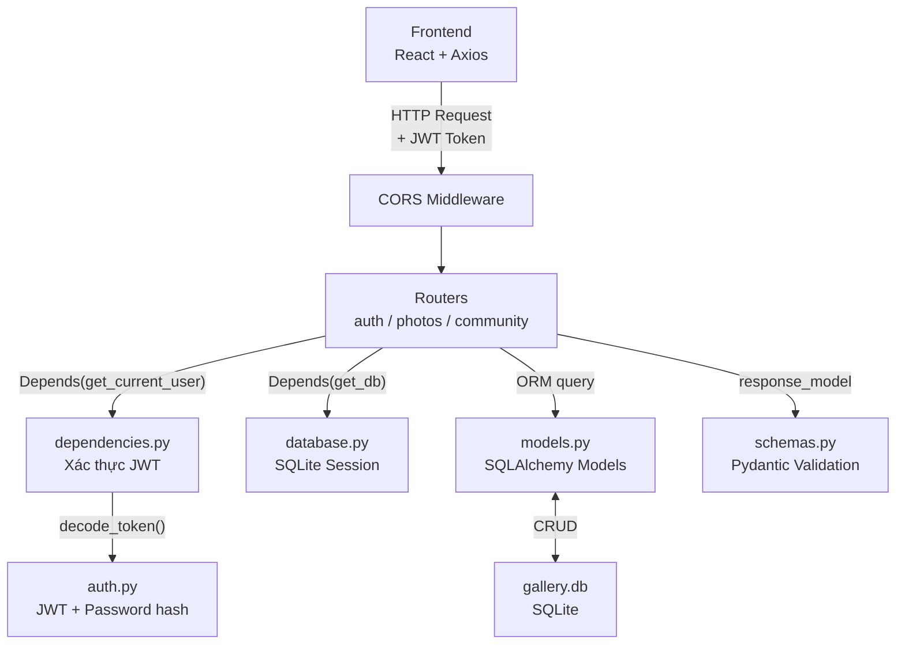
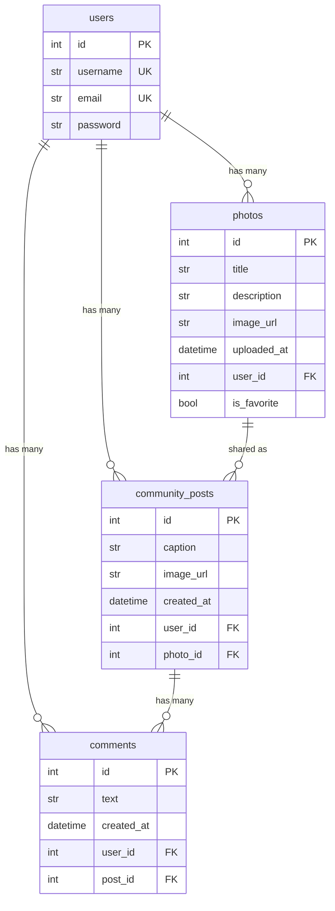

# 📖 Giải Thích + Cheatsheet Backend

## Tổng quan kiến trúc



## Bản đồ file — File nào làm gì?

| File | Vai trò | Khi nào cần sửa? |
|------|---------|-------------------|
| `database.py` | Kết nối SQLite, tạo Session | Hầu như không sửa |
| `auth.py` | Hash password, tạo/giải mã JWT | Đổi secret key, thời gian hết hạn |
| `dependencies.py` | `get_current_user` — xác thực token | Hầu như không sửa |
| `models.py` | Định nghĩa bảng (ORM) | **Thêm cột, thêm bảng mới** |
| `schemas.py` | Validate input/output (Pydantic) | **Thêm field cho request/response** |
| `routers/auth.py` | Endpoints đăng ký/đăng nhập | Thêm logic auth mới |
| `routers/photos.py` | CRUD ảnh + favorite | **Thêm endpoint ảnh mới** |
| `routers/community.py` | Post + comment | **Thêm endpoint community** |
| `main.py` | Gom routers, CORS, startup | **Đăng ký router mới** |

---

## 1. `database.py` — Kết nối cơ sở dữ liệu

```python
SQLALCHEMY_DATABASE_URL = "sqlite:///./gallery.db"

engine = create_engine(
    SQLALCHEMY_DATABASE_URL,
    connect_args={"check_same_thread": False},  # SQLite yêu cầu tham số này
)
SessionLocal = sessionmaker(autocommit=False, autoflush=False, bind=engine)
Base = declarative_base()   # Class cha cho mọi model

def get_db():
    db = SessionLocal()     # Mở session
    try:
        yield db            # Đưa session vào endpoint (qua Depends)
    finally:
        db.close()          # Đóng session sau khi request xong
```

> [!NOTE]
> `get_db()` là **dependency generator**. FastAPI tự gọi `next()` để lấy `db`, và khi request kết thúc thì chạy `finally` để đóng kết nối.

---

## 2. `auth.py` — Xác thực & mã hóa

```python
# Cấu hình
SECRET_KEY = "replace-this-with-a-long-random-secret"
ALGORITHM = "HS256"
ACCESS_TOKEN_EXPIRE_MINUTES = 60 * 24   # Token sống 24 giờ

# Hash password (khi đăng ký)
pwd_context.hash("mypassword")    # → "$pbkdf2-sha256$..."

# Verify password (khi đăng nhập)
pwd_context.verify("mypassword", hashed)  # → True/False

# Tạo JWT token (sau login thành công)
create_access_token(subject=user.email)
# → "eyJhbGciOiJIUzI1NiJ9.eyJzdWIiOiJ0ZXN0..."

# Giải mã token (khi verify request)
decode_token("eyJ...")  # → "user@email.com" hoặc None
```

**Luồng xác thực:**
```
Login → verify_password ✓ → create_access_token → trả JWT cho frontend
                                                    ↓
Mọi request sau → Header: Authorization: Bearer <JWT>
                                                    ↓
dependencies.py → decode_token → tìm user bằng email → trả models.User
```

---

## 3. `dependencies.py` — Middleware xác thực user

```python
def get_current_user(
    credentials = Depends(security),    # Lấy token từ header
    db: Session = Depends(get_db),      # Lấy database session
) -> models.User:
    # 1. Không có token → 401
    # 2. Token không hợp lệ → 401
    # 3. Email trong token không tìm thấy user → 401
    # 4. Mọi thứ OK → trả về models.User object
```

> [!TIP]
> Mọi endpoint cần xác thực chỉ cần thêm `current_user: models.User = Depends(get_current_user)` vào tham số là xong.

---

## 4. `models.py` — Định nghĩa bảng (ORM)

### Cấu trúc 1 Model:

```python
class Photo(Base):
    __tablename__ = "photos"   # Tên bảng trong SQLite
    
    # Các cột
    id = Column(Integer, primary_key=True, index=True)
    title = Column(String(255), nullable=False, index=True)
    description = Column(Text, nullable=True)
    image_url = Column(String(255), nullable=False)
    uploaded_at = Column(DateTime(timezone=True), server_default=func.now())
    user_id = Column(Integer, ForeignKey("users.id", ondelete="CASCADE"), nullable=False)
    is_favorite = Column(Boolean, default=False)
    
    # Quan hệ (không tạo cột, chỉ tạo thuộc tính Python)
    owner = relationship("User", back_populates="photos")
```

### Các kiểu dữ liệu cột:

| Kiểu SQLAlchemy | Python tương ứng | Ví dụ |
|-----------------|-------------------|-------|
| `Integer` | `int` | id, user_id |
| `String(255)` | `str` | title, email |
| `Text` | `str` (dài) | description, caption |
| `Boolean` | `bool` | is_favorite |
| `DateTime` | `datetime` | uploaded_at, created_at |

### Các bảng hiện có:



---

## 5. `schemas.py` — Validation Input/Output (Pydantic)

### 3 loại schema:

| Loại | Dùng khi | Ví dụ |
|------|----------|-------|
| **Input (Create)** | Nhận dữ liệu từ frontend | `UserCreate`, `CommentCreate` |
| **Output (Out)** | Trả dữ liệu cho frontend | `PhotoOut`, `CommentOut` |
| **Update** | Cập nhật 1 phần dữ liệu | `PhotoUpdate` |

```python
# Input: Frontend gửi lên
class CommentCreate(BaseModel):
    text: str                       # Bắt buộc

# Output: Backend trả về
class PhotoOut(BaseModel):
    id: int
    title: str
    description: str | None         # Có thể null
    image_url: str
    uploaded_at: datetime
    user_id: int
    is_favorite: bool
    model_config = ConfigDict(from_attributes=True)  # Cho phép convert từ ORM object
```

> [!IMPORTANT]
> `model_config = ConfigDict(from_attributes=True)` cho phép Pydantic tự chuyển từ SQLAlchemy model (object có `.id`, `.title`...) sang JSON. Không có dòng này sẽ bị lỗi.

---

## 6. Routers — Các endpoint API

### Bảng tóm tắt tất cả endpoints:

| Method | URL | Chức năng | Auth? |
|--------|-----|-----------|-------|
| POST | `/api/auth/register` | Đăng ký | ❌ |
| POST | `/api/auth/login` | Đăng nhập | ❌ |
| POST | `/api/photos/` | Upload ảnh | ✅ |
| GET | `/api/photos/?search=&sort=` | Danh sách ảnh | ✅ |
| GET | `/api/photos/{id}` | Chi tiết 1 ảnh | ✅ |
| PUT | `/api/photos/{id}` | Sửa title/description | ✅ |
| PATCH | `/api/photos/{id}/favorite` | Toggle yêu thích | ✅ |
| DELETE | `/api/photos/{id}` | Xóa ảnh | ✅ |
| POST | `/api/community/` | Share ảnh lên community | ✅ |
| GET | `/api/community/` | Danh sách bài community | ✅ |
| POST | `/api/community/{id}/comments` | Thêm comment | ✅ |
| DELETE | `/api/community/{id}` | Xóa bài post | ✅ |

### Cấu trúc 1 endpoint:

```python
@router.get("/{photo_id}", response_model=schemas.PhotoOut)  # ← URL + schema trả về
def get_photo(
    photo_id: int,                                        # ← URL path parameter
    current_user: models.User = Depends(get_current_user), # ← Xác thực token
    db: Session = Depends(get_db),                        # ← Database session
):
    # 1. Query database
    photo = db.query(models.Photo).filter(
        models.Photo.id == photo_id,
        models.Photo.user_id == current_user.id           # ← Chỉ xem ảnh của mình
    ).first()
    
    # 2. Kiểm tra tồn tại
    if not photo:
        raise HTTPException(status_code=404, detail="Photo not found")
    
    # 3. Trả về (Pydantic tự convert)
    return photo
```

---

## 7. `main.py` — Gom tất cả lại

```python
app = FastAPI(title="Gallery App API")

# CORS: cho phép frontend (localhost:5173) gọi API
app.add_middleware(CORSMiddleware, allow_origins=["http://localhost:5173"], ...)

# Đăng ký tất cả routers
app.include_router(auth.router)       # /api/auth/*
app.include_router(photos.router)     # /api/photos/*
app.include_router(community.router)  # /api/community/*

# Serve file ảnh tĩnh
app.mount("/uploads", StaticFiles(directory=uploads_dir), name="uploads")

# Tự tạo bảng khi khởi động
@app.on_event("startup")
def on_startup():
    Base.metadata.create_all(bind=engine)
```

---

# 🛠️ Cheatsheet — Tự Sửa Backend

## 1. Thêm cột mới vào bảng có sẵn

### Ví dụ: Thêm cột `views` vào bảng `photos`

**Bước 1:** Sửa `models.py` — thêm cột
```python
class Photo(Base):
    # ... các cột cũ ...
    views = Column(Integer, default=0)     # ← THÊM DÒNG NÀY
```

**Bước 2:** Sửa `schemas.py` — thêm field vào Output
```python
class PhotoOut(BaseModel):
    # ... các field cũ ...
    views: int                              # ← THÊM DÒNG NÀY
```

**Bước 3:** Xóa database cũ → khởi động lại
```bash
# Tắt server trước (Ctrl+C)
del gallery.db
python -m uvicorn app.main:app --reload
# Bảng mới sẽ được tạo tự động
```

> [!CAUTION]
> SQLite **KHÔNG** tự thêm cột mới. Phải xóa `gallery.db` rồi tạo lại. **Mất toàn bộ dữ liệu** — chỉ phù hợp khi đang phát triển.

---

## 2. Thêm endpoint API mới vào router có sẵn

### Ví dụ: API lấy ảnh yêu thích `GET /api/photos/favorites`

Mở `routers/photos.py`, thêm:

```python
@router.get("/favorites", response_model=list[schemas.PhotoOut])
def list_favorites(
    current_user: models.User = Depends(get_current_user),
    db: Session = Depends(get_db),
):
    return (
        db.query(models.Photo)
        .filter(
            models.Photo.user_id == current_user.id,
            models.Photo.is_favorite == True,
        )
        .order_by(models.Photo.uploaded_at.desc())
        .all()
    )
```

> [!WARNING]
> Endpoint `/favorites` phải đặt **TRƯỚC** `/{photo_id}` trong file. Nếu không, FastAPI sẽ hiểu "favorites" là `photo_id` → lỗi.

**Lưu file → uvicorn tự reload → test: `http://localhost:8000/docs`**

---

## 3. Tạo router hoàn toàn mới

### Ví dụ: Tạo router cho Tags

**Bước 1:** Tạo file `routers/tags.py`

```python
from fastapi import APIRouter, Depends, HTTPException, status
from sqlalchemy.orm import Session

from .. import models, schemas
from ..database import get_db
from ..dependencies import get_current_user

router = APIRouter(prefix="/api/tags", tags=["tags"])


@router.get("/")
def list_tags(
    current_user: models.User = Depends(get_current_user),
    db: Session = Depends(get_db),
):
    # Logic ở đây
    return [{"id": 1, "name": "Nature"}]
```

**Bước 2:** Đăng ký trong `main.py`

```python
from .routers import auth, community, photos, tags   # ← thêm tags

app.include_router(tags.router)                       # ← thêm dòng này
```

**Bước 3:** Lưu → uvicorn tự reload.

---

## 4. Thêm query parameter (lọc/sắp xếp)

### Ví dụ: Thêm filter theo `is_favorite` cho `GET /api/photos/`

```python
@router.get("/", response_model=list[schemas.PhotoOut])
def list_photos(
    search: str | None = None,
    sort: str | None = "newest",
    favorite_only: bool = False,              # ← THÊM THAM SỐ
    current_user: models.User = Depends(get_current_user),
    db: Session = Depends(get_db),
):
    query = db.query(models.Photo).filter(models.Photo.user_id == current_user.id)
    
    if search:
        query = query.filter(models.Photo.title.ilike(f"%{search}%"))
    
    if favorite_only:                          # ← THÊM LOGIC
        query = query.filter(models.Photo.is_favorite == True)
    
    if sort == "oldest":
        query = query.order_by(models.Photo.uploaded_at.asc())
    else:
        query = query.order_by(models.Photo.uploaded_at.desc())
    
    return query.all()
```

Frontend gọi: `api.get("/photos", { params: { favorite_only: true } })`

---

## 5. Thêm schema cho request/response mới

### Input schema (nhận dữ liệu):
```python
class TagCreate(BaseModel):
    name: str                    # Bắt buộc
    color: str = "#ff6b35"       # Có default → optional
```

### Output schema (trả dữ liệu):
```python
class TagOut(BaseModel):
    id: int
    name: str
    color: str
    photo_count: int

    model_config = ConfigDict(from_attributes=True)
```

### Sử dụng trong endpoint:
```python
@router.post("/", response_model=TagOut, status_code=status.HTTP_201_CREATED)
def create_tag(payload: TagCreate, ...):
    # payload.name, payload.color tự được validate
    ...
```

---

## Các thao tác CRUD cơ bản (Copy-paste)

### CREATE (Tạo mới):
```python
item = models.Photo(title="...", user_id=current_user.id)
db.add(item)
db.commit()
db.refresh(item)    # Lấy id + giá trị default từ DB
return item
```

### READ (Đọc):
```python
# Lấy 1 bản ghi
photo = db.query(models.Photo).filter(models.Photo.id == photo_id).first()

# Lấy danh sách
photos = db.query(models.Photo).filter(models.Photo.user_id == current_user.id).all()

# Lọc + sắp xếp
query = db.query(models.Photo)
query = query.filter(models.Photo.title.ilike(f"%{search}%"))
query = query.order_by(models.Photo.uploaded_at.desc())
results = query.all()
```

### UPDATE (Cập nhật):
```python
photo = db.query(models.Photo).filter(models.Photo.id == photo_id).first()
photo.title = "New Title"        # Thay đổi thuộc tính
photo.is_favorite = True
db.commit()
db.refresh(photo)
return photo
```

### DELETE (Xóa):
```python
photo = db.query(models.Photo).filter(models.Photo.id == photo_id).first()
db.delete(photo)
db.commit()
# Trả về 204 No Content
```

---

## Test API nhanh

### Dùng Swagger UI tích hợp:
Mở trình duyệt → `http://localhost:8000/docs`

### Hoặc dùng curl:
```bash
# Login
curl -X POST http://localhost:8000/api/auth/login \
  -H "Content-Type: application/json" \
  -d '{"email": "test@test.com", "password": "123456"}'

# Dùng token từ login response
curl http://localhost:8000/api/photos/ \
  -H "Authorization: Bearer eyJhbGciOiJI..."
```

---

## Checklist trước khi lưu

- [ ] **Model thay đổi?** → Phải xóa `gallery.db` và restart server
- [ ] **Schema Output đủ field?** → Thiếu field sẽ lỗi validation
- [ ] **Endpoint có `Depends(get_current_user)`?** → Nếu cần xác thực
- [ ] **Router mới đã đăng ký trong `main.py`?**
- [ ] **Endpoint `/abc` đặt TRƯỚC `/{id}`?** → Tránh conflict URL

---

## Debug nhanh

| Lỗi | Nguyên nhân | Cách sửa |
|-----|-------------|----------|
| `500 table has no column named X` | Model có cột mới nhưng DB cũ | Xóa `gallery.db` → restart |
| `422 Unprocessable Entity` | Dữ liệu gửi lên sai format | Kiểm tra schema Input |
| `401 Unauthorized` | Token thiếu/sai/hết hạn | Login lại lấy token mới |
| `404 Not Found` | URL sai hoặc data không tồn tại | Kiểm tra URL endpoint + ID |
| `405 Method Not Allowed` | Sai HTTP method (GET vs POST) | Kiểm tra `@router.get/post/put/...` |
| Import lỗi sau khi thêm file mới | Thiếu `__init__.py` hoặc import sai | Kiểm tra đường dẫn `from .. import ...` |
