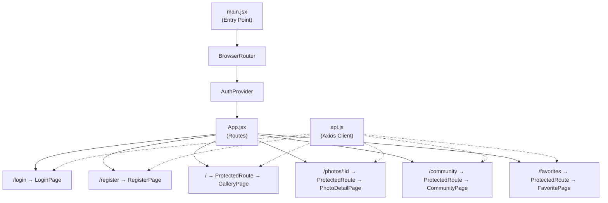
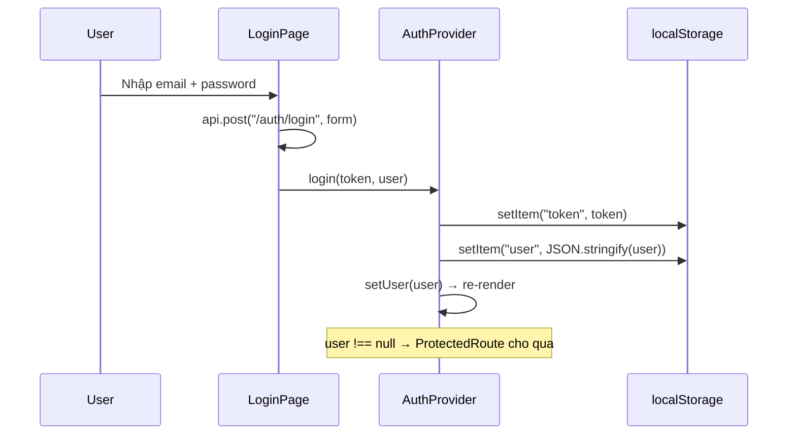
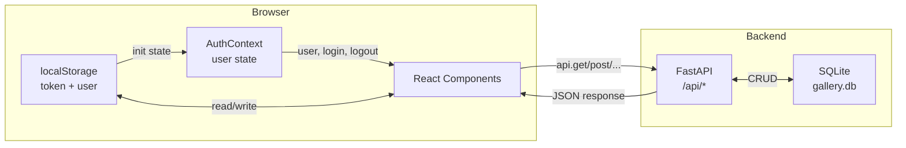

# 📖 Giải Thích Toàn Bộ Code Frontend

## Tổng quan kiến trúc



---

## 1. Entry Point — `main.jsx`

```jsx
ReactDOM.createRoot(document.getElementById("root")).render(
  <React.StrictMode>
    <BrowserRouter>
      <AuthProvider>
        <App />
      </AuthProvider>
    </BrowserRouter>
  </React.StrictMode>
);
```

**Giải thích từng lớp bọc (wrapper):**

| Lớp | Vai trò |
|-----|---------|
| `React.StrictMode` | Chế độ phát triển, cảnh báo lỗi tiềm ẩn |
| `BrowserRouter` | Cung cấp hệ thống routing (điều hướng URL) cho toàn app |
| `AuthProvider` | Cung cấp context xác thực (user, login, logout) cho mọi component con |
| `App` | Component chứa định nghĩa các routes |

> [!IMPORTANT]
> Thứ tự bọc rất quan trọng: `BrowserRouter` phải bọc ngoài `App` (vì App dùng `<Routes>`), và `AuthProvider` phải bọc ngoài các page cần truy cập thông tin user.

---

## 2. API Client — `api.js`

```jsx
const api = axios.create({
  baseURL: import.meta.env.VITE_API_URL || "http://localhost:8000/api",
});

api.interceptors.request.use((config) => {
  const token = localStorage.getItem("token");
  if (token) {
    config.headers.Authorization = `Bearer ${token}`;
  }
  return config;
});
```

**Giải thích:**

1. **`axios.create()`** — Tạo 1 instance axios riêng với `baseURL` = `http://localhost:8000/api`. Mọi request sẽ tự thêm prefix này.
2. **`interceptors.request.use()`** — **Middleware** chạy trước MỌI request. Nó đọc JWT token từ `localStorage` và tự động gắn vào header `Authorization: Bearer <token>`.

> [!TIP]
> Nhờ interceptor, các page không cần tự thêm token — chỉ cần gọi `api.get(...)`, `api.post(...)` là token tự được gắn.

---

## 3. AuthContext — Quản lý xác thực toàn cục

```jsx
const AuthContext = createContext(null);
```

### 3.1. `AuthProvider` — Component cung cấp state xác thực

```jsx
export function AuthProvider({ children }) {
  // Khởi tạo user từ localStorage (để giữ đăng nhập khi refresh)
  const [user, setUser] = useState(() => {
    const raw = localStorage.getItem("user");
    return raw ? JSON.parse(raw) : null;  // null = chưa đăng nhập
  });

  const login = (token, nextUser) => {
    localStorage.setItem("token", token);        // Lưu JWT token
    localStorage.setItem("user", JSON.stringify(nextUser));  // Lưu thông tin user
    setUser(nextUser);  // Cập nhật state → re-render toàn app
  };

  const logout = () => {
    localStorage.removeItem("token");
    localStorage.removeItem("user");
    setUser(null);  // null → ProtectedRoute sẽ redirect về /login
  };

  const value = useMemo(() => ({ user, login, logout }), [user]);
  return <AuthContext.Provider value={value}>{children}</AuthContext.Provider>;
}
```

**Luồng hoạt động:**



### 3.2. `useAuth()` — Custom hook để truy cập context

```jsx
export function useAuth() {
  const context = useContext(AuthContext);
  if (!context) {
    throw new Error("useAuth must be used inside AuthProvider");
  }
  return context;  // { user, login, logout }
}
```

Bất kỳ component nào gọi `useAuth()` sẽ nhận được object `{ user, login, logout }`.

---

## 4. ProtectedRoute — Bảo vệ route

```jsx
function ProtectedRoute({ children }) {
  const { user } = useAuth();
  if (!user) {
    return <Navigate to="/login" replace />;  // Chưa login → redirect
  }
  return children;  // Đã login → render page bình thường
}
```

**Logic đơn giản:**
- `user === null` → chưa đăng nhập → chuyển về `/login`
- `user !== null` → đã đăng nhập → render `children` (trang cần bảo vệ)

---

## 5. App.jsx — Định nghĩa Routes

```jsx
<Routes>
  {/* Routes công khai */}
  <Route path="/login" element={<LoginPage />} />
  <Route path="/register" element={<RegisterPage />} />

  {/* Routes được bảo vệ */}
  <Route path="/" element={<ProtectedRoute><GalleryPage /></ProtectedRoute>} />
  <Route path="/photos/:id" element={<ProtectedRoute><PhotoDetailPage /></ProtectedRoute>} />
  <Route path="/community" element={<ProtectedRoute><CommunityPage /></ProtectedRoute>} />
  <Route path="/favorites" element={<ProtectedRoute><FavoritePage /></ProtectedRoute>} />

  {/* Mọi URL khác → redirect về trang chủ */}
  <Route path="*" element={<Navigate to="/" replace />} />
</Routes>
```

| Path | Component | Bảo vệ? | Mô tả |
|------|-----------|---------|-------|
| `/login` | LoginPage | ❌ | Trang đăng nhập |
| `/register` | RegisterPage | ❌ | Trang đăng ký |
| `/` | GalleryPage | ✅ | Gallery cá nhân |
| `/photos/:id` | PhotoDetailPage | ✅ | Chi tiết 1 ảnh |
| `/community` | CommunityPage | ✅ | Bảng tin cộng đồng |
| `/favorites` | FavoritePage | ✅ | Ảnh yêu thích |

---

## 6. LoginPage — Trang đăng nhập

### State:
```jsx
const [form, setForm] = useState({ email: "", password: "" });  // Dữ liệu form
const [error, setError] = useState("");  // Thông báo lỗi
```

### Luồng xử lý khi submit:

```jsx
const handleSubmit = async (event) => {
  event.preventDefault();   // Ngăn reload trang
  setError("");             // Xóa lỗi cũ

  try {
    // 1. Gọi API đăng nhập
    const { data } = await api.post("/auth/login", form);
    // data = { access_token: "...", user: { id, username, email } }

    // 2. Lưu token + user vào AuthContext + localStorage
    login(data.access_token, data.user);

    // 3. Chuyển hướng về trang chủ
    navigate("/");
  } catch (err) {
    // 4. Hiển thị lỗi nếu đăng nhập thất bại
    setError(err.response?.data?.detail || "Login failed");
  }
};
```

### UI:
- Form với 2 input (email, password)
- Nút "Login"
- Link sang trang đăng ký
- Hiển thị lỗi nếu có

---

## 7. RegisterPage — Trang đăng ký

Gần giống LoginPage nhưng thêm field `username`:

```jsx
const [form, setForm] = useState({ username: "", email: "", password: "" });
```

Sau khi đăng ký thành công, **tự động đăng nhập luôn** (gọi `login()`) và chuyển về trang chủ.

---

## 8. GalleryPage — Trang gallery chính

### 8.1. State Management

```jsx
// Dữ liệu chính
const [photos, setPhotos] = useState([]);        // Mảng ảnh từ API
const [search, setSearch] = useState("");         // Từ khóa tìm kiếm
const [sortOrder, setSortOrder] = useState("newest"); // Thứ tự sắp xếp
const [loading, setLoading] = useState(true);
const [error, setError] = useState("");

// Upload (hỗ trợ nhiều file)
const [files, setFiles] = useState([]);           // Mảng File objects
const [previews, setPreviews] = useState([]);     // Mảng URL preview
const [title, setTitle] = useState("");
const [description, setDescription] = useState("");
const [isDragging, setIsDragging] = useState(false); // Đang kéo file qua drop zone?
const [uploading, setUploading] = useState(false);

// Chỉnh sửa ảnh (inline edit)
const [editingId, setEditingId] = useState(null);
const [editTitle, setEditTitle] = useState("");
const [editDescription, setEditDescription] = useState("");
```

### 8.2. Preview ảnh trước khi upload

```jsx
useEffect(() => {
  if (files.length === 0) { setPreviews([]); return; }
  const urls = files.map((f) => URL.createObjectURL(f));  // Tạo URL tạm
  setPreviews(urls);
  return () => urls.forEach((u) => URL.revokeObjectURL(u)); // Cleanup (giải phóng bộ nhớ)
}, [files]);
```

> [!NOTE]
> `URL.createObjectURL()` tạo URL tạm trỏ đến file trong bộ nhớ trình duyệt. Phải gọi `revokeObjectURL()` khi không cần nữa để tránh memory leak.

### 8.3. Drag & Drop

```jsx
// 4 event handlers:
handleDragEnter  → Tăng counter, bật isDragging
handleDragLeave  → Giảm counter, khi counter = 0 thì tắt isDragging
handleDragOver   → preventDefault (bắt buộc để drop hoạt động)
handleDrop       → Lấy files từ e.dataTransfer, lọc image, thêm vào state
```

> [!TIP]
> `dragCounter` dùng `useRef` (không phải `useState`) vì không cần re-render khi thay đổi. Counter giải quyết vấn đề `dragLeave` bị gọi sai khi di chuột qua phần tử con.

### 8.4. Upload nhiều ảnh

```jsx
for (let i = 0; i < files.length; i++) {
  const formData = new FormData();
  formData.append("file", files[i]);
  formData.append("title", files.length === 1 ? title : `${title} (${i + 1})`);
  formData.append("description", description);
  await api.post("/photos/", formData);  // Upload tuần tự
}
```

Backend chỉ nhận 1 file/request, nên frontend gửi nhiều request tuần tự. Title được đánh số tự động nếu upload nhiều file.

### 8.5. Favorite (Optimistic Update)

```jsx
const toggleFavorite = async (photoId) => {
  // 1. Cập nhật UI NGAY (không chờ API)
  setPhotos((prev) =>
    prev.map((p) => p.id === photoId ? { ...p, is_favorite: !p.is_favorite } : p)
  );
  try {
    await api.patch(`/photos/${photoId}/favorite`);  // 2. Gọi API
  } catch (err) {
    // 3. ROLLBACK nếu API lỗi
    setPhotos((prev) =>
      prev.map((p) => p.id === photoId ? { ...p, is_favorite: !p.is_favorite } : p)
    );
  }
};
```

> [!IMPORTANT]
> **Optimistic Update** = cập nhật UI trước rồi mới gọi API. Nếu API lỗi thì rollback. Giúp UI cảm giác nhanh và mượt.

### 8.6. Share to Community

```jsx
const handleShare = async (photoId) => {
  const caption = prompt("Add a caption...");  // Hộp thoại nhập caption
  if (caption === null) return;  // User bấm Cancel

  const formData = new FormData();
  formData.append("photo_id", photoId);
  formData.append("caption", caption);
  await api.post("/community/", formData);
};
```

---

## 9. PhotoDetailPage — Chi tiết ảnh

### State:
```jsx
const [photo, setPhoto] = useState(null);          // Dữ liệu ảnh
const [isFavorite, setIsFavorite] = useState(false); // Trạng thái yêu thích
const [error, setError] = useState("");
```

### Fetch ảnh khi mount:
```jsx
useEffect(() => {
  const fetchPhoto = async () => {
    const { data } = await api.get(`/photos/${id}`);
    setPhoto(data);
    setIsFavorite(data.is_favorite);  // Khởi tạo từ API response
  };
  fetchPhoto();
}, [id]);  // Chạy lại khi id thay đổi
```

### Toggle favorite (Optimistic + Sync):
```jsx
const toggleFavorite = async () => {
  setIsFavorite((prev) => !prev);              // Optimistic
  const { data } = await api.patch(`/photos/${id}/favorite`);
  setIsFavorite(data.is_favorite);             // Đồng bộ với server
};
```

### UI hiển thị:
- Ảnh lớn + title + nút ❤️/🤍
- Mô tả + ngày upload
- Nút "Back to gallery"

---

## 10. CommunityPage — Bảng tin cộng đồng

### State:
```jsx
const [posts, setPosts] = useState([]);          // Mảng bài đăng
const [commentTexts, setCommentTexts] = useState({}); // { postId: "text" }
const [submitting, setSubmitting] = useState(null);   // postId đang submit comment
const [favorites, setFavorites] = useState({});       // { postId: boolean }
```

### Fetch posts + trạng thái favorite:
```jsx
const { data } = await api.get("/community");
setPosts(data);

// Với mỗi post có photo_id, gọi API lấy is_favorite
for (const p of data) {
  if (p.photo_id) {
    const { data: photo } = await api.get(`/photos/${p.photo_id}`);
    favMap[p.id] = photo.is_favorite;
  }
}
setFavorites(favMap);
```

### Comment (cập nhật state local):
```jsx
const handleComment = async (postId) => {
  const { data: newComment } = await api.post(`/community/${postId}/comments`, { text });

  // Thêm comment mới vào đúng post TRONG STATE (không cần fetch lại)
  setPosts((prev) =>
    prev.map((p) =>
      p.id === postId ? { ...p, comments: [...p.comments, newComment] } : p
    )
  );
};
```

### timeAgo — Tính thời gian tương đối:
```jsx
const timeAgo = (dateStr) => {
  const utc = dateStr.endsWith("Z") ? dateStr : dateStr + "Z";  // Fix UTC
  const diff = Date.now() - new Date(utc).getTime();
  // → "5s ago", "3m ago", "2h ago", "1d ago"
};
```

### UI mỗi post:
1. **Header** — Avatar (chữ cái đầu) + username + thời gian
2. **Image** — Ảnh full-width
3. **Actions** — Nút ❤️ yêu thích
4. **Caption** — `<strong>username</strong> caption text`
5. **Comments** — Danh sách comment (scrollable)
6. **Add comment** — Input + nút Post

---

## 11. FavoritePage — Trang ảnh yêu thích

```jsx
// Gọi API lấy chỉ ảnh có is_favorite = true
const response = await api.get("/photos/favorites");
setPhotos(response.data);

// Toggle: gọi API rồi fetch lại toàn bộ
const toggleFavorite = async (photoId) => {
  await api.patch(`/photos/${photoId}/favorite`);
  fetchFavoritePhotos();  // Re-fetch để ảnh bị unlike sẽ biến mất
};
```

---

## Tổng quan luồng dữ liệu



## Tóm tắt các kỹ thuật React sử dụng

| Kỹ thuật | Nơi sử dụng | Mục đích |
|----------|-------------|----------|
| `useState` | Mọi page | Quản lý state local |
| `useEffect` | Fetch data, preview URL | Side effects khi mount/update |
| `useContext` | AuthContext | Chia sẻ state xác thực toàn app |
| `useCallback` | Drag-drop handlers, addFiles | Tránh tạo function mới mỗi render |
| `useMemo` | subtitle trong Gallery | Cache giá trị tính toán |
| `useRef` | fileInputRef, dragCounter | Giá trị không gây re-render |
| Optimistic Update | toggleFavorite | UI phản hồi nhanh, rollback nếu lỗi |
| Interceptor | api.js | Tự gắn JWT token vào mọi request |
